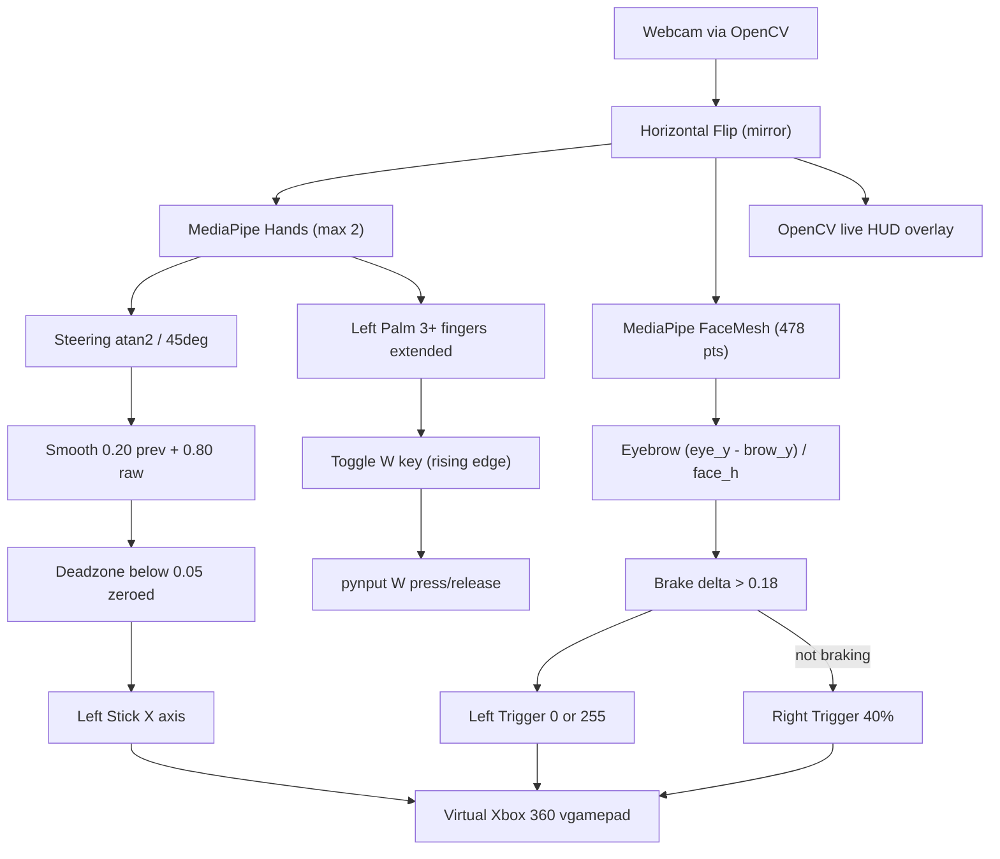
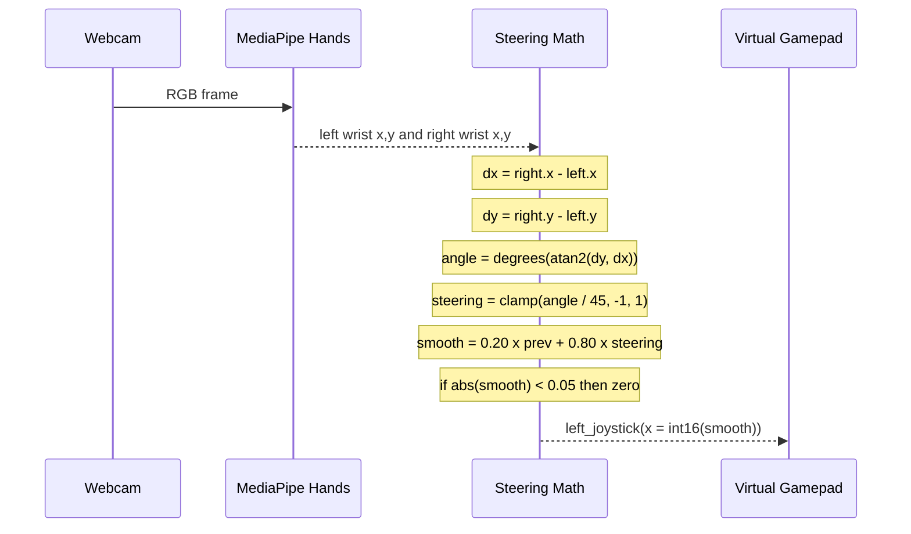
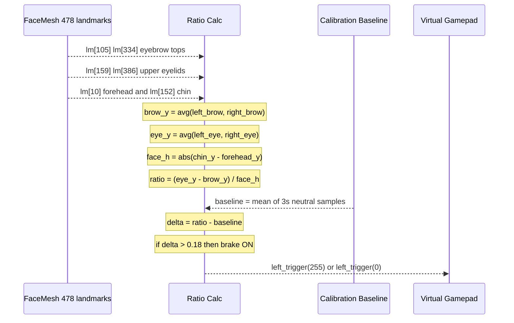
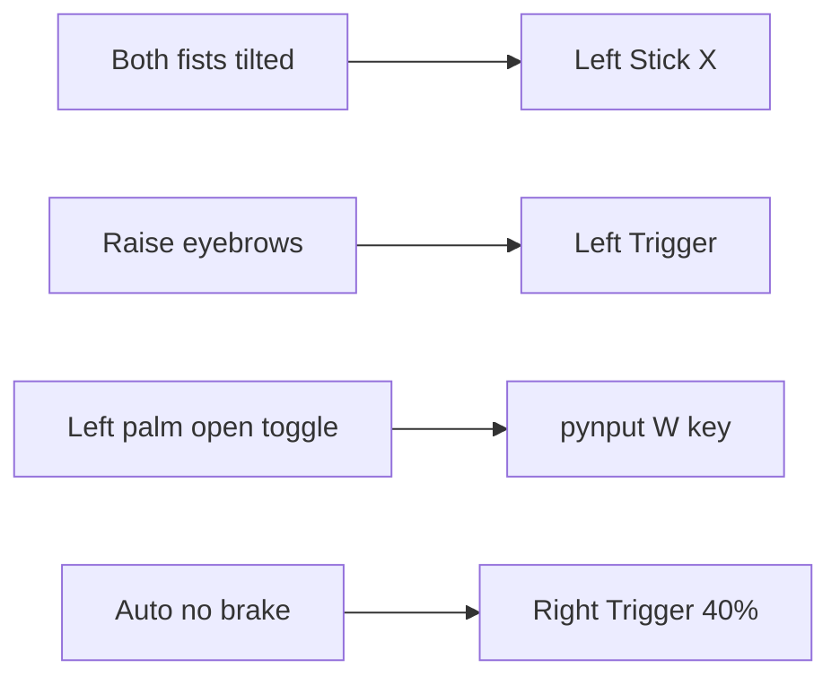
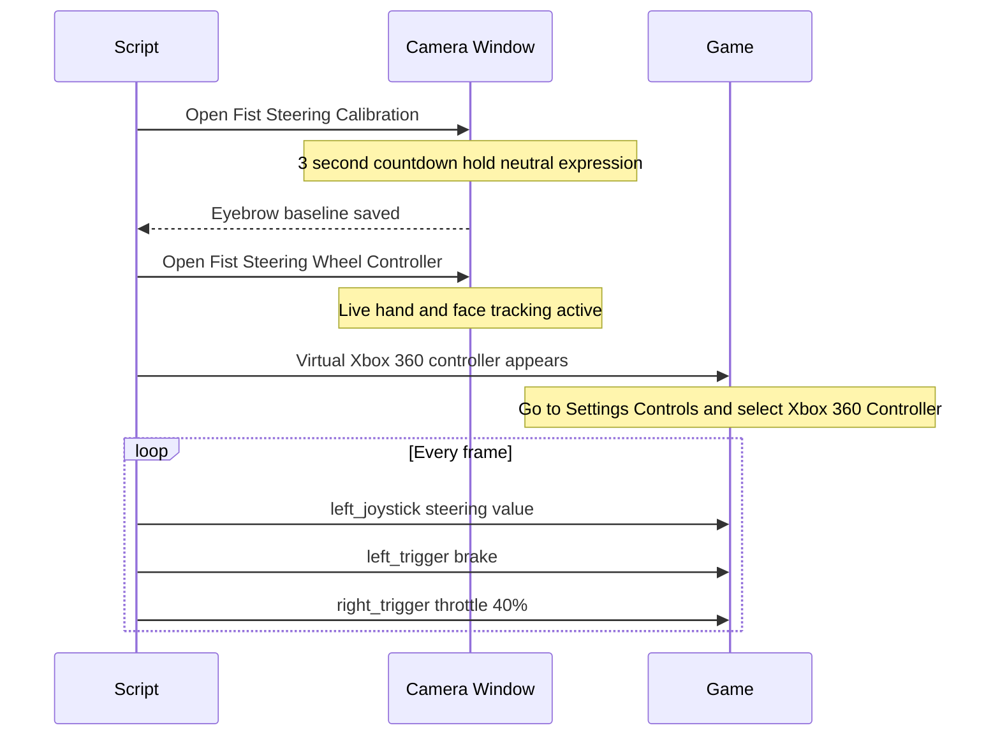

<div align="center">

# 🎮 Fist Steering Wheel Controller

**Control any driving game with your bare hands — no hardware, no phone, just a webcam.**

[](https://python.org)
[](https://microsoft.com)
[](https://mediapipe.dev)
[](https://github.com/nefarius/ViGEmBus)

> A single Python process that reads your webcam, tracks your hands and face in real-time using MediaPipe, and outputs a **virtual Xbox 360 controller** that any game can read — analog steering, a brake trigger, and a W-key toggle, all driven purely by gesture.

---

### 🚗 Try it immediately — no install needed

**Test game:** [Super Star Car on Poki](https://poki.com/en/g/super-star-car)  
Open the game, launch the script, tilt your fists — you're racing.

</div>

---

## ✨ What it does

| Gesture | What happens |
|---|---|
| 🤜🤛 Hold **both fists** up, tilt left/right | Analog left-stick X-axis — proportional steering |
| 🙍 **Raise eyebrows** | Left trigger fully pressed — brake |
| 🤚 Open **left palm** | Toggles `W` key held / released — gas in keyboard games |
| *(automatic)* | Right trigger at 40% — constant auto-throttle when not braking |

> **Why not keyboard?**  
> Keyboard keys are binary (down/up). A steering wheel needs a *continuous* value from −1.0 to +1.0. This project outputs a real virtual Xbox 360 controller axis — the same signal a physical thumbstick sends — so the game sees smooth, proportional turning at every angle.

---

## 🏗️ Architecture



---

## 🧠 How each gesture is computed

### Steering — wrist angle → analog axis



**When fewer than 2 hands are visible**, `smooth_steer *= 0.85` each frame — steering decays to zero rather than freezing at the last value.

---

### Brake — eyebrow raise → left trigger



---

### W-key toggle — left open palm

```mermaid
stateDiagram-v2
    direction LR
    [*] --> Fist : startup
    Fist --> Palm : open left palm
    Palm --> Fist : open left palm again

    state Fist {
        note right of Fist: Left fist closed, W released
    }
    state Palm {
        note right of Palm: Left palm open, W held
    }
```

**Side detection:** After `cv2.flip(frame, 1)` (mirror mode), `wrist_x < 0.5` reliably identifies the user's physical left hand regardless of which hand MediaPipe labels it.

---

## 🗂️ Controller output map



---

## ⚙️ Tunable constants

All constants live at the **very top of `fist_steering.py`** — edit once, nowhere else.

| Constant | Default | What it controls |
|---|---|---|
| `MAX_TILT_DEG` | `45.0` | Tilt angle (°) for full ±1.0 steering lock |
| `SMOOTHING` | `0.20` | Exponential smoothing weight — 0 = raw, 1 = frozen |
| `DEADZONE` | `0.05` | Noise floor — values below this are zeroed and rescaled |
| `EYEBROW_RAISE_THRESHOLD` | `0.18` | Eyebrow-delta fraction above baseline that triggers brake |
| `CALIBRATION_SECONDS` | `3` | Hold-neutral countdown duration at startup |
| `AUTO_THROTTLE_ENABLED` | `True` | Toggle constant right-trigger throttle on/off |
| `AUTO_THROTTLE_VALUE` | `0.40` | Right-trigger strength when auto-throttle is active |
| `LOST_HAND_DECAY` | `0.85` | Per-frame steering decay multiplier when hands leave frame |
| `PALM_KEYS_ENABLED` | `True` | Toggle the left-palm → W feature on/off |
| `PALM_OPEN_FINGERS` | `3` | Minimum extended fingers to count as "open palm" (1–4) |
| `CAMERA_INDEX` | `0` | Webcam index — change if you have multiple cameras |

---

## 🚀 Setup — Windows (from GitHub)

### Prerequisites

- **Windows 10 or 11** (64-bit)
- **Python 3.9 – 3.11** — [download here](https://www.python.org/downloads/)  
  ✅ Check **"Add Python to PATH"** during install
- A **webcam** (built-in or USB)

---

### Step 1 — Clone the repo

```powershell
git clone https://github.com/YOUR_USERNAME/gamecv.git
cd gamecv
```

---

### Step 2 — Install Python dependencies

```powershell
pip install opencv-python "mediapipe==0.10.21" vgamepad pynput
```

> **`mediapipe==0.10.21`** is pinned because version 1.x removed the `mp.solutions` API that this project uses.

---

### Step 3 — Install the ViGEmBus driver (one-time)

`vgamepad` wraps the **ViGEmBus** kernel driver to create virtual Xbox controllers. It will attempt to auto-install on first run.

**If the auto-install fails** (common on UAC-hardened systems):

1. Right-click your terminal shortcut → **Run as Administrator**
2. `python fist_steering.py`
3. Accept the **Nefarius Virtual Gamepad Emulation Bus Driver** license dialog that appears
4. After install completes, you never need admin again

---

### Step 4 — Run

```powershell
python fist_steering.py
```

**What happens:**



---

### Step 5 — Play!

Open [Super Star Car](https://poki.com/en/g/super-star-car) (or any driving game), go to its **Controls / Input settings**, and select the **Xbox 360 Controller** that has appeared.

Then:

| Do this | Game input |
|---|---|
| ✊✊ Hold both fists up, level | Car goes straight |
| ↙️ Tilt left (right wrist higher) | Steer left — continuously proportional |
| ↘️ Tilt right (right wrist lower) | Steer right — continuously proportional |
| 😲 Raise eyebrows | Brake |
| 🖐 Open left palm | W key held (gas in keyboard-mode games) |
| 🖐 Open left palm again | W key released |
| `Q` in camera window | Clean quit — all inputs reset to neutral |

---

## 📦 Package as a standalone `.exe`

No Python required on the target machine:

```powershell
pip install pyinstaller
pyinstaller --onefile --noconsole --name FistSteering fist_steering.py
```

Output: `dist\FistSteering.exe`

> ⚠️ The end user still needs **ViGEmBus** installed. The first run of the `.exe` will attempt to auto-install it — run as Administrator once to allow that.

---

## 🔧 Troubleshooting

| Symptom | Fix |
|---|---|
| `AttributeError: module 'mediapipe' has no attribute 'solutions'` | `pip install "mediapipe==0.10.21"` |
| `Could not create virtual gamepad` | Run as Administrator once to install ViGEmBus |
| Steering jitters / drifts | Increase `SMOOTHING` or `DEADZONE` |
| Brake fires too easily | Increase `EYEBROW_RAISE_THRESHOLD` |
| W toggles by itself | Increase `PALM_OPEN_FINGERS` to 4 |
| Wrong camera opens | Change `CAMERA_INDEX` to 1, 2, etc. |
| Steering reversed | Physically hold fists the other way, or negate the atan2 result |

---

## 🏛️ Tech stack

| Layer | Library | Purpose |
|---|---|---|
| Computer vision | `opencv-python 5.x` | Webcam capture, frame flip, HUD drawing |
| Hand tracking | `mediapipe 0.10.21` — `mp.solutions.hands` | 21 landmarks per hand, up to 2 hands |
| Face tracking | `mediapipe 0.10.21` — `mp.solutions.face_mesh` | 478 landmarks, `refine_landmarks=True` |
| Virtual controller | `vgamepad 0.1.0` + ViGEmBus | Virtual Xbox 360 `VX360Gamepad` |
| Keyboard injection | `pynput 1.8.x` | W key press/release for the palm toggle |
| Packaging | `pyinstaller` | Single-file `.exe` with `--onefile --noconsole` |

---

## 📄 License

MIT — do whatever you want with it.

---

<div align="center">
Made with ☕ and a webcam
</div>
