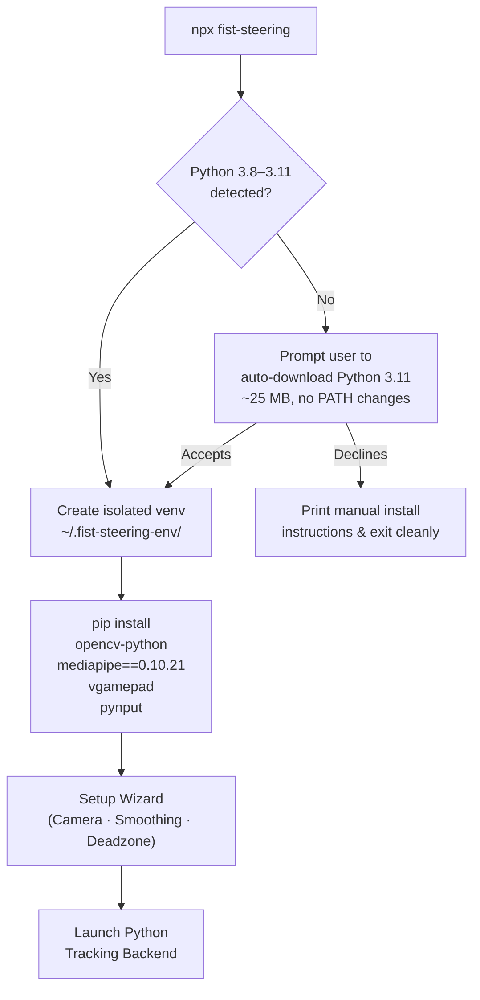
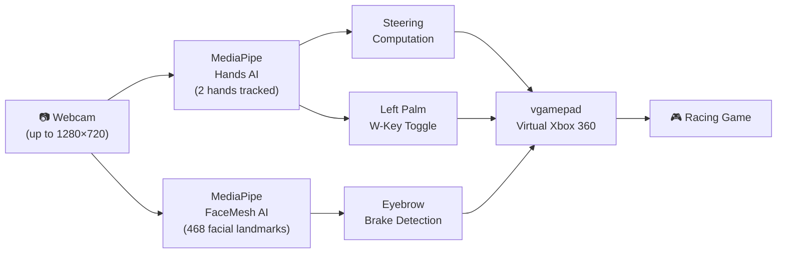
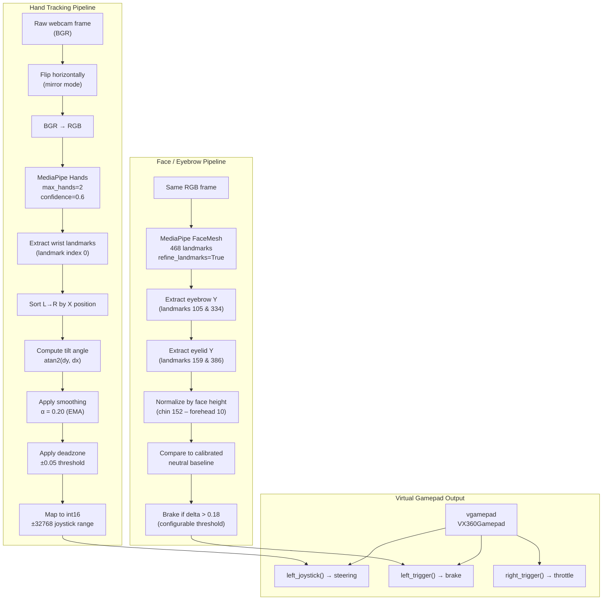
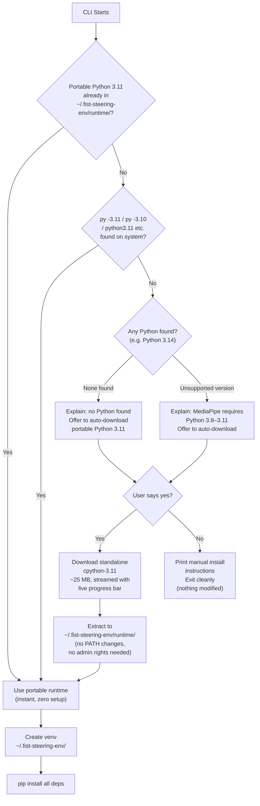
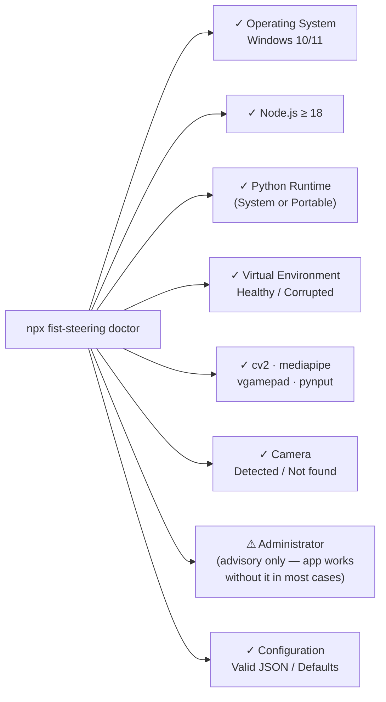
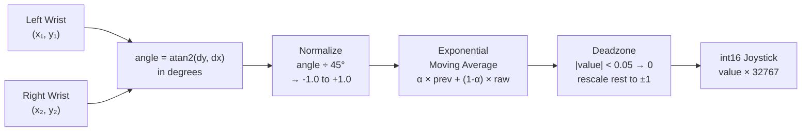

<div align="center">

# 🎮 Fist Steering

### Control any driving game with your bare hands — no hardware required.

A virtual Xbox 360 controller powered by **Google MediaPipe AI** and your webcam.  
Steer by tilting your fists. Brake by raising your eyebrows. Zero latency. Zero setup friction.

[](https://www.npmjs.com/package/fist-steering)
[](https://www.microsoft.com/windows)
[](LICENSE)

</div>

---

## ⚡ Quick Start

No Python setup. No environment configuration. One command.

```bash
npx fist-steering
```

On first run the CLI automatically:
1. Detects your Python version
2. Downloads **portable Python 3.11** if needed (~25 MB, doesn't touch your system)
3. Creates an isolated virtual environment
4. Installs OpenCV + MediaPipe + vgamepad
5. Runs the setup wizard for your camera and preferences
6. Launches the controller

> **After the first run, subsequent launches are instant** — the environment is cached in `~/.fist-steering-env/`.

---

## 🚀 How It Works





---

## 🎮 Controls

| Your Body Gesture | Game Action | Controller Mapping |
|:---|:---|:---|
| Both fists raised like a steering wheel | Steer Left / Right | Left Analog Stick X Axis |
| Tilt fists right (right hand lower) | Steer Right | Positive X Axis |
| Tilt fists left (left hand lower) | Steer Left | Negative X Axis |
| Raise both eyebrows | Brake | Left Trigger (0–100%) |
| No brake active | Auto-throttle | Right Trigger (40% constant) |
| Open Left Palm | Toggle `W` key held | Keyboard `W` press/release |
| Press `Q` in camera window | Exit cleanly | — |

---

## 🔒 Privacy & Security

> **All processing is 100% local. No webcam frames, no tracking data, and no personal information ever leave your machine.**

Fist Steering runs two AI pipelines (MediaPipe Hands + FaceMesh) entirely on your CPU using your local Python environment. It has no network connection during tracking, no analytics, no telemetry, and no cloud dependency of any kind.

The only network calls the CLI ever makes:
- **First run only:** Downloads portable Python 3.11 from `python.org` (only if no compatible Python is found, only once)
- **Background update check:** Queries `registry.npmjs.org` for the latest version number — no personal data sent

---

## 🧠 AI Architecture

The tracking backend is a single Python process running two parallel MediaPipe pipelines:



---

## 🖥️ CLI Commands

```bash
# Launch the controller (runs setup on first use)
npx fist-steering

# Re-run the full configuration wizard
npx fist-steering setup

# Print your current settings at a glance
npx fist-steering config show

# Change one setting without re-running the wizard
npx fist-steering config set smooth 0.30
npx fist-steering config set camera 1
npx fist-steering config set disableBrake true

# Delete config and start wizard from scratch
npx fist-steering reset

# Run system health checks (Flutter-style doctor)
npx fist-steering doctor

# Measure FPS, latency, and CPU/RAM performance
npx fist-steering benchmark

# Benchmark for exactly N seconds
npx fist-steering benchmark --time 30

# Force rebuild / update the Python environment
npx fist-steering update

# Generate a diagnostic report (for GitHub issues)
npx fist-steering report

# Remove all fist-steering data (config + Python env)
npx fist-steering uninstall

# Print version
npx fist-steering --version

# Install globally (run without npx)
npm install -g fist-steering
fist-steering
```

---

## ⚙️ Configuration

Your settings are saved at `~/.fist-steering/config.json`.

**View your current settings:**
```bash
npx fist-steering config show
```

**Change a single setting without running the wizard:**
```bash
npx fist-steering config set <key> <value>
# Examples:
npx fist-steering config set smooth 0.30
npx fist-steering config set camera 1
npx fist-steering config set disableBrake true
```

**Re-run the full interactive wizard:**
```bash
npx fist-steering setup
```

| Setting | Default | Description |
|:---|:---:|:---|
| `camera` | `0` | Camera index (0 = first webcam) |
| `smooth` | `0.20` | Exponential moving average factor. `0.0` = raw, `0.99` = heavy lag |
| `deadzone` | `0.05` | Ignore steering inputs smaller than this to filter micro-jitters |
| `tilt` | `45.0` | Max tilt angle in degrees before steering reaches ±1.0 |
| `eyebrowThreshold` | `0.18` | How much above neutral your eyebrows must go to trigger a brake |
| `throttleValue` | `0.40` | Auto-throttle right trigger value when not braking (0.0–1.0) |
| `disableBrake` | `false` | Disable eyebrow braking (skips FaceMesh, saves CPU) |
| `disableThrottle` | `false` | Disable auto-throttle completely |
| `disablePalm` | `false` | Disable left palm W-key toggle |
| `palmFingers` | `3` | Minimum extended fingers to count as "open palm" |

---

## 👁️ Eyebrow Calibration

When braking is enabled, Fist Steering **automatically calibrates your neutral eyebrow position** at the start of every session. You don't need to run any extra command.

**What happens at launch:**
1. The app asks you to hold a neutral facial expression for **3 seconds**
2. It measures your resting eyebrow position as a baseline
3. During play, any raise above that baseline triggers the brake

```
[CALIBRATION] Hold a NEUTRAL expression for 3 seconds…
[CALIBRATION] Done. Eyebrow baseline = 0.1293
```

**Tips for accurate calibration:**
- Face the camera straight on, at the same distance you'll play from
- Keep a relaxed, neutral expression — don't smile or frown during calibration
- If the brake triggers accidentally, increase `eyebrowThreshold`: `npx fist-steering config set eyebrowThreshold 0.25`
- To skip calibration entirely: `npx fist-steering config set disableBrake true`

---

## 🐍 Python Runtime Management



> **Your existing Python 3.14 (or any version) is never modified or uninstalled.**  
> The portable runtime lives entirely inside `~/.fist-steering-env/runtime/`.

---

## 🩺 Doctor Command

The `doctor` command inspects your system and reports the status of every component:



---

## 📁 Project Structure

```
fist-steering/
├── bin/
│   └── gamecv.js          # CLI entry point — routes all commands
├── lib/
│   ├── python.js          # Python runtime detection, download, venv management
│   ├── setup.js           # Interactive setup wizard (camera, smoothing, deadzone)
│   ├── config.js          # Read/write ~/.fist-steering/config.json
│   ├── doctor.js          # System health checks
│   ├── benchmark.js       # FPS / performance benchmarking
│   ├── report.js          # Diagnostic report generator
│   └── update-checker.js  # Background npm update notifications
├── fist_steering.py       # Python tracking backend (MediaPipe + vgamepad)
└── package.json
```

---

## 🔧 How Steering Math Works



---

## ⚠️ Troubleshooting

**`npx fist-steering doctor`** will diagnose most issues automatically. Common problems:

| Symptom | Fix |
|:---|:---|
| Windows Defender / SmartScreen blocks first run | See the [Antivirus & SmartScreen](#%EF%B8%8F-antivirus--smartscreen) section below |
| ViGEmBus driver not installing | Run your terminal as **Administrator** at least once |
| Camera not detected | Windows Settings → Privacy → Camera → allow desktop apps |
| "mediapipe not found" error | Run `npx fist-steering update` to rebuild the Python environment |
| Steering is too sensitive | `npx fist-steering config set tilt 60` (or higher) |
| Accidental braking | `npx fist-steering config set eyebrowThreshold 0.25` |
| Steering feels laggy | `npx fist-steering config set smooth 0.10` (lower = snappier) |
| Steering jitters at center | `npx fist-steering config set deadzone 0.08` (higher = more stable) |

---

## 🛡️ Antivirus & SmartScreen

On first run, Windows Defender or SmartScreen may flag fist-steering. **This is a false positive.** Here's why it happens and what to do:

| What triggers it | Why it's safe |
|:---|:---|
| Portable Python download (~25 MB) | Downloaded directly from `python.org`'s official GitHub releases |
| `vgamepad` installing ViGEmBus driver | ViGEmBus is a widely-used open-source virtual controller driver |
| npm package running a `.py` file | The Python script is open-source and in this repo |

**If SmartScreen blocks the terminal:**
1. Click **"More info"** on the SmartScreen popup
2. Click **"Run anyway"**
3. This only needs to happen once

**If Windows Defender quarantines the portable Python:**
1. Open Windows Security → Virus & threat protection → Protection history
2. Find the quarantined item and click **"Allow"**
3. Run `npx fist-steering update` to rebuild the environment

---

## 🐛 Reporting Issues

Found a bug? Hit a crash? Something behaving weirdly?

**Step 1 — Generate a diagnostic report from your terminal:**
```bash
npx fist-steering report
```
This creates a `fist-steering-report.md` file with your OS, Node, Python, venv status, and current config — everything needed to debug your issue.

**Step 2 — Open a GitHub issue and attach the report:**

> **[👉 Open an issue on GitHub](https://github.com/shryssssss-maker/fist-steering/issues)**

You can also run `npx fist-steering help` to see this link directly in your terminal.

---

## 🔄 Staying Updated

Fist Steering automatically checks for updates in the background every time it launches. If a newer version is available, you'll see a banner:

```
╭────────────────────────────────────────────╮
│ Update available!  1.1.2  →  1.1.3              │
│ Run: npx fist-steering@latest                   │
╰────────────────────────────────────────────╯
```

The banner automatically shows the right update command for how you're running it:

| How you run it | Update command shown |
|:---|:---|
| `npx fist-steering` | `npx fist-steering@latest` |
| `npm install -g fist-steering` | `npm update -g fist-steering` |

> **Why `@latest` for npx?** npx caches packages locally, so running `npx fist-steering` again may use the old cached version. `npx fist-steering@latest` forces a fresh fetch of the newest release.

---

## 🗑️ Uninstalling

To remove all fist-steering data from your machine:

```bash
npx fist-steering uninstall
```

This deletes:
- `~/.fist-steering/` — your config / settings
- `~/.fist-steering-env/` — the Python virtual environment + portable runtime (~500 MB)

You will be asked to confirm before anything is deleted.

**To also remove the ViGEmBus driver (optional):**
1. Open **Windows Settings → Apps → Installed apps**
2. Search for **"ViGEm Bus Driver"** and uninstall it

**To remove the npm package itself:**
```bash
npm uninstall -g fist-steering   # if you installed globally
```

---

## 🆕 What's New in v1.1.3

| Feature | Details |
|:---|:---|
| Smarter update banner | Detects npx vs global install and shows the correct update command (`npx fist-steering@latest` vs `npm update -g fist-steering`) |
| Proper semver comparison | Dev builds (local version newer than npm) no longer trigger a false update banner |
| 🔄 Staying Updated section | README now explains the auto-update banner and the `@latest` trick for npx users |

## 🆕 What's New in v1.1.2

| Feature | Details |
|:---|:---|
| `npx fist-steering uninstall` command | Safely removes config and Python env with confirmation prompt, plus ViGEmBus removal steps |
| 👁️ Eyebrow Calibration section | README explains the auto-calibration step at launch — hold neutral expression for 3 seconds |
| 🔒 Privacy & Security section | Explicitly states all processing is 100% local with no data leaving the machine |
| 🛡️ Antivirus / SmartScreen guide | Step-by-step fix for Defender / SmartScreen false positives on first run |

## 🆕 What's New in v1.1.1

| Feature | Details |
|:---|:---|
| GitHub issues link in `report` command | After generating a report, the CLI now prints the exact URL to open an issue |
| GitHub issues link in `--help` | `npx fist-steering help` shows where to report bugs |
| GitHub issues link on crash | Any unexpected error now prints the issues URL + a hint to run `report` |

## 🆕 What's New in v1.1.0

| Feature | Command |
|:---|:---|
| View all your settings at a glance | `npx fist-steering config show` |
| Change one setting without the wizard | `npx fist-steering config set <key> <value>` |
| Help discovery tip after setup | Setup wizard now ends with a tip to run `npx fist-steering help` |
| Doctor admin check is now advisory only | `npx fist-steering doctor` no longer fails if not running as admin |

---

## 📋 Requirements

| Requirement | Details |
|:---|:---|
| **OS** | Windows 10 or 11 (64-bit) |
| **Node.js** | ≥ 18.0.0 |
| **Python** | 3.8, 3.9, 3.10, or 3.11 (auto-downloaded if missing) |
| **Webcam** | Any USB or built-in webcam |
| **ViGEmBus** | Auto-installed by `vgamepad` on first run (requires admin once) |

---

## 📜 License

MIT © [shryssssss-maker](https://github.com/shryssssss-maker)
